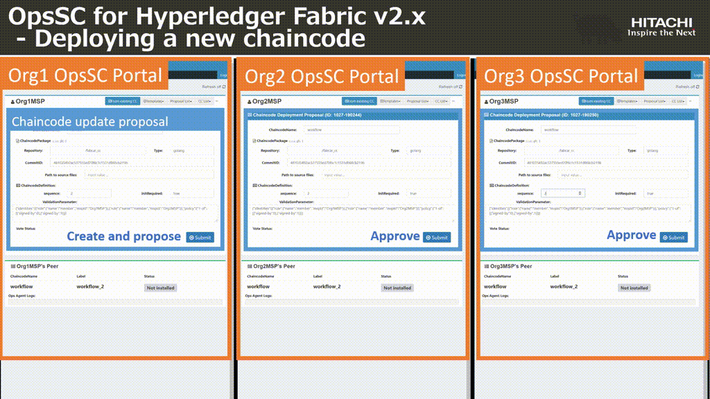
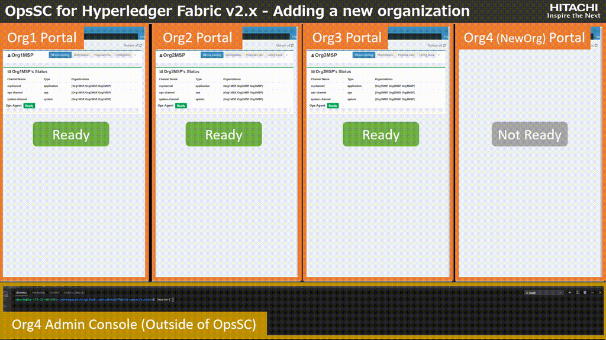

# Materials for OpsSC for Hyperledger Fabric v2.x

## Presentation slide
- [OpsSC for Hyperledger Fabric v2.x](./materials/OpsSC_for_Hyperledger_Fabric_v2.x_pub.pdf)

## Demo movies

### Scenario 1: Deploying a new chaincode (the demo takes about 1.5 mins)

- [Download mp4 file (file size: 24 MB)](./materials/OpsSC_chaincode.mp4)

### Scenario 2: Adding a new chaincode (the demo takes about 3 mins)

- [Download mp4 file (file size: 62 MB)](./materials/OpsSC_channel.mp4)